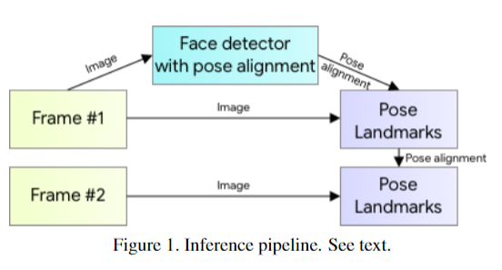
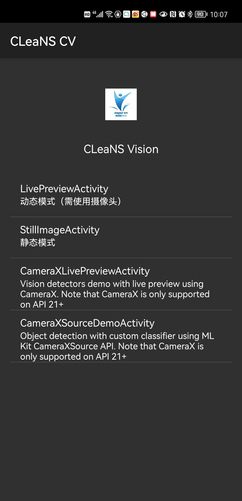

# Human-body-key-point-detection
**Project**: Fitness counter using human key point detection

### Human pose estimation

BlazePose is a lightweight, on-device single person-specific human pose estimation model.



Paper:  [2006.10204v1.pdf (arxiv.org)](https://arxiv.org/pdf/2006.10204v1.pdf) 

you can find the code at  [Human-body-key-point-detection/models at master · 1zeryu/Human-body-key-point-detection (github.com)](https://github.com/1zeryu/Human-body-key-point-detection/tree/master/models) 

### Mediapipe

In this project, I am calling the already trained BlazePose model from mediapipe for **human keypoint detection**.

*You can configure the required environment by*

```python
!pip3 install mediapipe==0.8.7.4 opencv-python numpy --upgrade --user -i http://mirrors.aliyun.com/pypi/simple/ --trusted-host mirrors.aliyun.com
```

You can click on the following links for more information:  [Pose - mediapipe (google.github.io)](https://google.github.io/mediapipe/solutions/pose) 

You can also quickly learn how to detect key points in the human body by looking at my tutorial: 

But I recommend watching the video for more information: https://www.bilibili.com/video/BV1dL4y1h7Q6?spm_id_from=333.1007.top_right_bar_window_custom_collection.content.click

### 
Use of key point detection models for deep squat counting, and other applications.

### Stage3: Deploy
Deploy applications to mobile or web